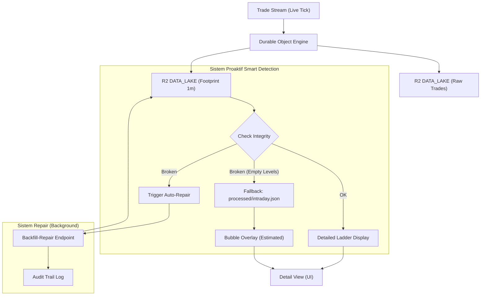

# Dokumentasi Arsitektur Data Detail Emiten (Footprint Chart)

## 🎯 Objective
Tujuan utama dari sistem ini adalah memberikan pandangan **mikroskopis** terhadap aktivitas perdagangan saham dalam bentuk **Footprint Chart**. 

Secara spesifik, kita ingin:
1.  **Detail Per Level Harga**: Menunjukkan di harga mana saja "pertempuran" antara pembeli (Haka) dan penjual (Haki) terjadi secara granular (Tier 1).
2.  **Reliability Tinggi**: Menjamin grafik tetap muncul dan informatif meskipun data detail (levels) sedang bermasalah atau hilang, dengan menggunakan sistem *Smart Fallback* (Tier 2 & 3).
3.  **Self-Repairing System (Auto-Repair)**: Sistem secara proaktif mendeteksi data yang rusak dan melakukan perbaikan otomatis di latar belakang tanpa harus menunggu intervensi manual.

---

## 1. Alur Data (Flowchart)



---

## 2. Struktur Sumber Data (Data Mentah)

Data utama diambil langsung dari **Cloudflare R2** (Bucket: `tape-data-saham`). Data ini disimpan dalam format **NDJSON** per jam dengan resolusi 1 menit.

### A. Lokasi File (R2 Path)
`footprint/{TICKER}/1m/{YYYY}/{MM}/{DD}/{HH}.jsonl`
- **Backend Handler**: `api-saham/src/index.js` (Endpoint `/footprint-raw-hist`)

### B. Struktur Data 1-Menit
Setiap baris dalam file `.jsonl` mewakili 1 menit perdagangan:
```json
{
  "t0": 1770344400000,
  "ohlc": { "o": 1325, "h": 1325, "l": 1325, "c": 1325 },
  "vol": 112, "delta": -112,
  "levels": [
    { "p": 1325, "bv": 0, "av": 112 }
  ]
}
```
- `levels`: Berisi rincian volume di setiap harga (`p`), dipisahkan antara `bv` (Buy/Haka) dan `av` (Sell/Haki).

---

## 3. Proses Pengolahan (Agregasi 5-Menit)

Worker `api-saham` melakukan transformasi data secara *on-the-fly* saat endpoint `/symbol` dipanggil:

### A. Jendela Waktu (Time Window)
Sistem mengambil data dari jam **09:00 WIB (02:00 UTC)** hingga **16:00 WIB (09:00 UTC)**.

### B. Logika Agregasi
Data 1-menit dikelompokkan ke dalam bucket **5 menit** (`t0`):
- **File**: `api-saham/src/index.js`
- **Function**: `fetch` (Endpoint `/symbol`)

1.  **OHLC**:
    - `Open`: Harga pembuka menit pertama dalam bucket.
    - `High`: Harga tertinggi dari seluruh menit dalam bucket.
    - `Low`: Harga terendah dari seluruh menit dalam bucket.
    - `Close`: Harga penutup menit terakhir dalam bucket.
2.  **Levels Grouping**:
    - Seluruh `levels` dalam 5 menit dijumlahkan volumenya per harga (`p`).
    - Jika harga `1400` muncul di menit ke-1 dan menit ke-3, volumenya digabung.

---

## 4. Output (API Schema)

Endpoint `GET /symbol?kode={TICKER}&mode=footprint` menghasilkan JSON dengan struktur:

### A. Candles (Primary Chart)
Array data OHLC untuk render **Candlestick** di Chart.js.
```json
"candles": [
  { "x": 1770344400000, "o": 1325, "h": 1325, "l": 1325, "c": 1325 }
]
```

### B. History (Footprint Bubbles)
Array data granular per level harga untuk di-*overlay* di atas Candlestick.
```json
"history": [
  { 
    "t": "10:40", "x": 1770349200000, "p": 1385, 
    "v": 4, "bv": 0, "av": 4, "side": "sell" 
  }
]
```
- `x`: Timestamp yang sama dengan candle agar posisi horizontal (waktu) selaras.
- `r` (Radius): Dihitung secara dinamis di frontend berdasarkan proporsi volume `v`.

---

## 5. Sistem Smart Detection, Fallback & Auto-Repair

Sistem pada `api-saham` mendeteksi kesehatan data secara otomatis:
1.  **Deteksi Proaktif**: Jika file Tier 1 ada namun memiliki `levels: []` (kosong) padahal ada volume, maka data didiagnosis sebagai **Broken**.
2.  **Fallback Segera**: Sistem secara otomatis menyajikan data dari sumber cadangan (Tier 2/3) agar chart tetap tampil bagi user.
3.  **Auto-Trigger Repair**: Bersamaan dengan fallback, backend memicu request perbaikan ke Aggregator secara *asynchronous*.
4.  **UI Feedback**: UI menampilkan indikator "⚠️ Memperbaiki Data..." dan menyajikan bubble dari data fallback.

---

## 6. Mekanisme Background Repair

Proses perbaikan berjalan di latar belakang tanpa menghentikan aktivitas user:
- **Audit Logging**: Progress dicatat otomatis di `audit/${ticker}.json` (e.g., `START` dan `FINISH`).
- **Proses**: Worker memindai ulang data transaksi mentah (`raw_trades/`), menghitung ulang sebaran bid/ask dengan algoritma terbaru, dan menimpa file footprint R2.

---

## 7. Sinkronisasi Chart & Tabel

Data yang ditampilkan di Chart (Candlestick & Bubbles) tersinkronisasi sepenuhnya dengan Tabel di bagian bawah halaman.

### A. Format & Kolom Tabel
| Kolom | Deskripsi | Tipe Data |
| :--- | :--- | :--- |
| **Tanggal** | Tanggal transaksi (WIB) | String (DD/MM/YYYY) |
| **Jam** | Waktu agregasi (WIB) | String (HH:mm) |
| **Harga** | Harga penutup (*Last Price*) pada menit tersebut | Number |
| **Delta** | Selisih akumulatif Buy vs Sell | Number (Warna) |
| **Momentum** | Pergerakan harga relatif terhadap pembukaan | Percentage (%) |
| **Absorb** | Daya serap volume terhadap rentang harga | Number |
| **Value** | Total nilai transaksi (Volume × Harga × 100) | Currency (IDR) |

### B. Rumus Perhitungan Fitur (Features)
Fitur-fitur ini dihitung oleh worker `livetrade-taping-agregator` secara real-time:

1.  **Momentum (%)**
    > $$Momentum = \frac{Price_{current} - Price_{open\_day}}{Price_{open\_day}} \times 100$$
2.  **Absorption (Daya Serap)**
    > $$Absorption = \frac{Volume_{cumulative}}{High_{day} - Low_{day}}$$
3.  **Haka/Haki Balance (xAxis)**
    > $$xAxis = (( \frac{Buy\_Vol - Sell\_Vol}{Total\_Vol} + 1 ) \times 50) - 50$$

---

## 8. Logika Auto-Repair (Background Processing)

Sistem dirancang untuk memahami kriteria minimal kualitas data dan memperbaikinya sendiri.

### Alur Kerja Otomatis

1.  **Identifikasi Defisiensi**
    - **Worker**: `api-saham/src/index.js`
    Saat mengambil data footprint, sistem mengecek kriteria: `(volume > 0 AND levels.length == 0)`.

2.  **Pemicuan Background Job**
    Jika kriteria terpenuhi, sistem mengirim signal perbaikan ke:
    `POST /repair-footprint?kode={TICKER}&date={YYYY-MM-DD}`
    - Ini berjalan secara *fire-and-forget* dari sisi user request.

3.  **Pelacakan di UI**
    - **Frontend**: `idx/emiten/detail.html`
    UI menampilkan **loading bar** dan **persentase (%)** status bahwa perbaikan sedang berlangsung berdasarkan polling ke audit trail.

4.  **Finalisasi & Pemulihan**
    Begitu status audit trail menjadi `COMPLETED`, UI melakukan refresh otomatis dan menyajikan data "Ladder" yang sudah sehat.

---

## 9. Acceptance Criteria (Kriteria Penerimaan)

### Skenario 1: Memuat Halaman Detail (Data Normal)
- **IF** user membuka halaman detail emiten dengan data lengkap, **THEN** sistem harus menampilkan candelstick, bubbles footprint, dan tabel secara sinkron.

### Skenario 2: Deteksi Data Cacat & Auto-Repair
- **IF** system mendeteksi file footprint memiliki volume tetapi `levels` kosong, **THEN** system harus otomatis menyajikan data fallback dan memicu proses perbaikan di background.
- **IF** auto-repair dipicu, **THEN** sistem harus mencatat status `START` di Audit Trail emiten tersebut tanpa menunggu klik user.

### Skenario 3: Visualisasi Saat Repair
- **IF** proses perbaikan sedang berjalan di background, **THEN** UI harus menampilkan **loading bar** dan **status X%** (konsisten dengan tampilan Brokerflow).
- **IF** data fallback ditampilkan, **THEN** bubble harus tetap muncul berdasarkan data agregasi.

### Skenario 4: Kegagalan Sistem (Error Handling)
- **IF** system gagal mengambil data Tier 1 dan Fallback Tier 2, **THEN** system menampilkan pesan "Data sedang tidak stabil" dan tetap mencoba memicu repair.

### Skenario 5: Pemulihan Otomatis
- **IF** proses repair di background selesai (`COMPLETED`), **THEN** frontend harus mendeteksi perubahan tersebut dan melakukan refresh otomatis untuk menampilkan data Ladder yang benar.

---
